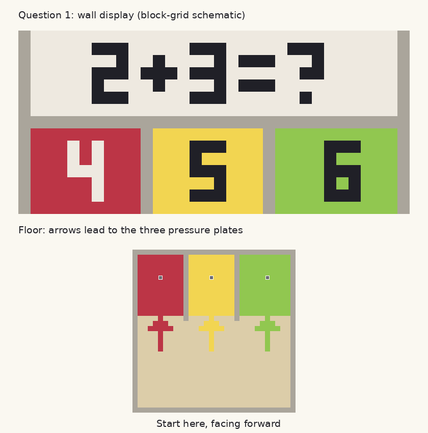

# Minecraft：さんすう3たくめいろ

Minecraft for Windows（Bedrock版）向け、小学1年生用の建築済みワールドです。
足し算5問・引き算5問、各3択。正解は次室、不正解は同じ室の入口に戻ります。
最後にお祝いの文字・音・パーティクルと、もう一度遊ぶ青い通路があります。

**配布ファイル：[`dist/math_maze_v3.mcworld`](dist/math_maze_v3.mcworld)**

建築はLevelDBに保存済み。ビヘイビアーパック、リソースパック、Script APIは不要です。
標準コマンドブロックで問題表示・感圧板の信号による回答結果表示・テレポートを行います。
冒険モード・ピースフル・一人用。11室を4列×3行の範囲に配置しています。
Bedrock 1.19.50系の保存形式を使用し、現在のWindows版で読み込むことを想定した試作版です。

## v3の表示修正

- 南向きに見る壁の数字を反転配置し、鏡写しを修正。選択肢も入口から見て赤・黄・緑の順に配置。
- □表示を避けるため、看板・画面表示を英数字に限定。床の矢印と大きな数式・答えを中心に操作。
- 回答場所を石の感圧板で明示。板を踏んだ信号で回答し、通路に入っただけでは回答しません。
- 壁の問題式と答えを高さ5ブロックの大きな数字で表示。2桁も収まるよう室を32×32へ拡張。
- 看板の補助説明は従来のサイズ。看板のフォントを拡大する方法ではありません。



## 導入・操作

1. `.mcworld`を保存し、ダブルクリックします。
2. インポート完了後、「遊ぶ」から「Math Maze v3」を開きます。
3. `W`で前進、マウスで向きを変えます。画面下の問題を読み、答えの通路へ進みます。
4. 入口から見て、赤・黄・緑の順です。答えの数字の前にある床の板を踏むと回答になります。クリックは不要です。
5. ゴールで終了。青い矢印の先の板を踏むと1問目から再開できます。

子どもはチャット入力・ブロック設置・パック有効化をする必要はありません。
最初の導入と操作説明は大人が行ってください。チート／コマンドブロックは有効のままにします。
既存の`.mcpack`をこのワールドへ追加しないでください。

## 検証範囲

[`dist/validation.json`](dist/validation.json)にSHA-256と検証結果を記録しています。

| 確認項目 | 状況 |
|---|---|
| ZIP、level.datのNBTとヘッダー、LevelDBの再読み込み | 合格 |
| 10問・30経路の計算と移動先、移動先の床・足元・頭上 | 合格 |
| 11室の床・壁・天井、80チャンクの保存と生成完了フラグ | 合格 |
| 保存済み107コマンドブロック・42看板、チェーン向きと有効化 | 合格 |
| v3の公式サーバーでの読み込み・回答動作 | 未検証（v2は合格） |
| v2でブタを使った30枚の感圧板からの自動移動 | 合格（v3の結果ではありません） |
| Windows版のインポートUI | 未検証 |
| Windows版での10問通しプレイ、看板表示、音・演出 | 未検証 |

ファイルの読み直しや経路探索の合格は、本体での動作保証とは区別します。
サーバー検証結果は[`dist/server_validation.json`](dist/server_validation.json)。現在のサーバー記録はv2についてのもので、v3のサーバー検証は未実施です。
元ワールドの107コマンドをコンソールへ投入して構文エラーがないことも確認しましたが、
プレイヤー未接続による対象なしの結果なので、文字・音の実行確認にはなりません。
実機確認手順は[`docs/PLAYTEST.md`](docs/PLAYTEST.md)、採用方式は[`docs/TECHNICAL_DESIGN.md`](docs/TECHNICAL_DESIGN.md)を参照してください。

## 再生成

Python 3.12で検証。依存ライブラリは専用の仮想環境に導入することを推奨します。

```bash
python -m venv .venv
# Linux/macOS: source .venv/bin/activate
# Windows: .venv\Scripts\activate
python -m pip install -r requirements.txt
python scripts/build_world.py
python scripts/verify_world.py
# 配置図（任意、Pillowが必要）
python scripts/render_preview.py
```

Linuxでコンパイラを探せない場合は`CC=gcc CXX=g++`を指定します。
Windowsでは依存ライブラリのビルド環境が必要になる場合があります。生成コードのWindows実行は未検証です。
プレイヤーはPythonをインストールする必要はありません。

問題は[`data/questions.json`](data/questions.json)、配置・コマンド一覧は[`dist/layout.json`](dist/layout.json)で管理します。
`build/`は作業用でGit対象外。ZIPのルートに`level.dat`と`db/`を格納します。

初版の`math_maze_v1.mcworld`は比較用です。新しく導入する場合はv3を使ってください。
